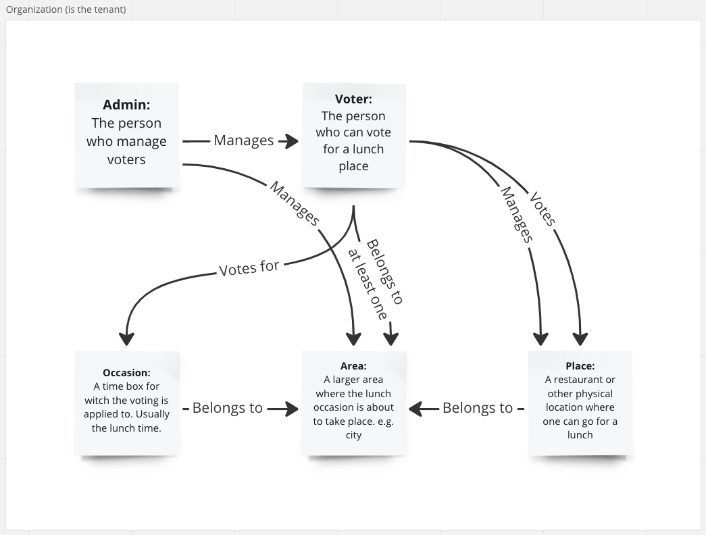

# Lunch Place Voting System

A system helping in finding a consensus for choosing a place to have lunch in.

Runs in [Kalix](https://www.kalix.io/) and scales horizontally.

Each entity instance (area, voter and occasion) can run on a separate hardware so in theory the solution's scalability is unlimited.

Secured by [JWT](https://jwt.io/).

## Solution is Addressing the Following Problems

* Lunch occasion participants don't have a tool to find consensus while finding a lunch place
* Lunch occasion participants can't remember all lunch place options
* Different personalities may make the verbal at-time-voting unequal

## Ubiquitous Language




## Prerequisite

* Docker & Docker Compose
* Java 11 or later
* sbt
* grpcui (nice to have)

See more: https://docs.kalix.io/java/index.html#_prerequisites

## Run

Open three terminals and run each command in project root in own tabs in given order.

```
docker-compose up
sbt run
grpcui -plaintext localhost:9000
```

## [JWT](https://jwt.io/)

JWT as a [Bearer token](https://www.rfc-editor.org/rfc/rfc6750) is required:
* User `Authorization` header in request metadata with JWT token as a value with `Bearer ` -prefix.

Required claims:
* `username` (`admin` has admin rights by default)
* `organization` (each organization is a tenant)

**Example:**

**gRPC UI:**


**[jwt.io](https://jwt.io/)**


## The Flow

1. As Admin (Username `admin`)
   1. Introduce Area -> Like `jyväskylä`
   2. Introduce Voter(s) -> Like `simo`, `seppo`
2. As Voter (`simo`)
   1. Introduce Place(s) -> Like `fitwok`, `basecamp`, `shalimar`, `nom`
   2. Publish Occasion -> Datetimed lunch occasion
   3. Vote a Place For the Occasion
3. As Voter 2 (`seppo`)
   1. Get Occasions
   2. Get Place IDs
   3. Vote a Place For the Occasion
4. See voting results
    1. Get Occasions 

## Known Issues

1. AreasWithVotersJoinView `LEFT JOIN` does not seem to work properly -> Can't see area before it has it's first voter
